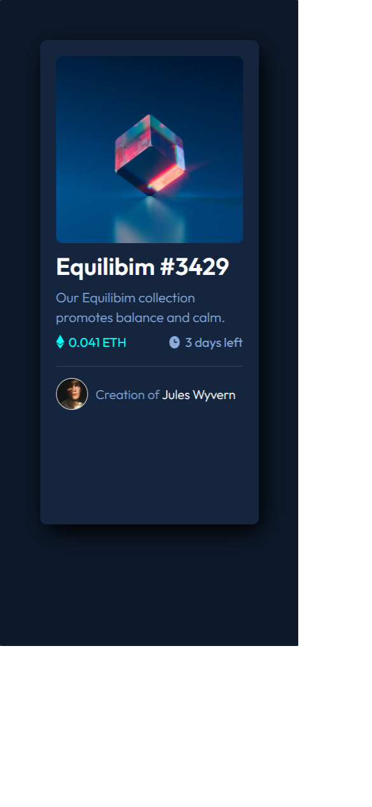

# Frontend Mentor - NFT preview card component solution

This is a solution to the [NFT preview card component challenge on Frontend Mentor](https://www.frontendmentor.io/challenges/nft-preview-card-component-SbdUL_w0U).

## Table of Contents

- [Screenshots](#screenshots)
- [Author](#author)

## Screenshots

- Project 375px:
    
- Project 1440px:
    

## Author

- Website - [Lucas Samuel Lemos Rajão](https://www.your-site.com)
- Frontend Mentor - [@codeMaestroLucas](https://github.com/codeMaestroLucas)

This is my irt time making the FE Mentor Challenge.

Im studing IT and discovering this new wolrd in baby steps.
